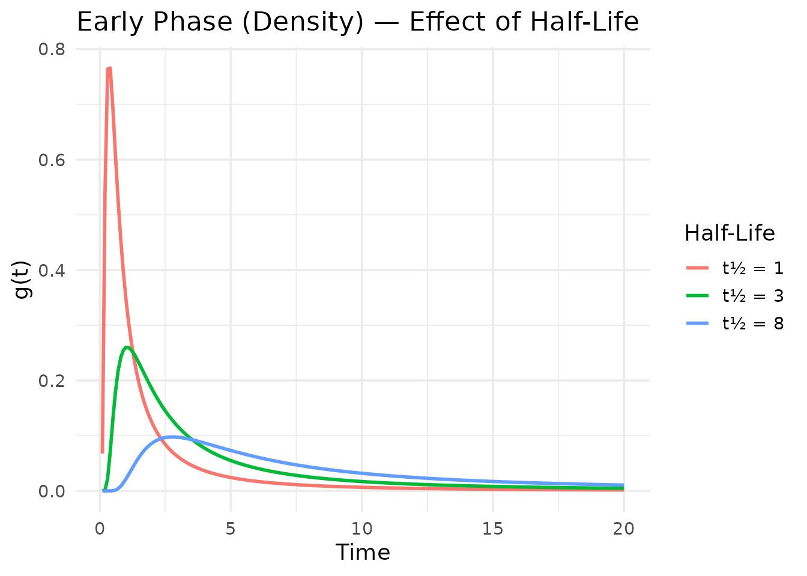
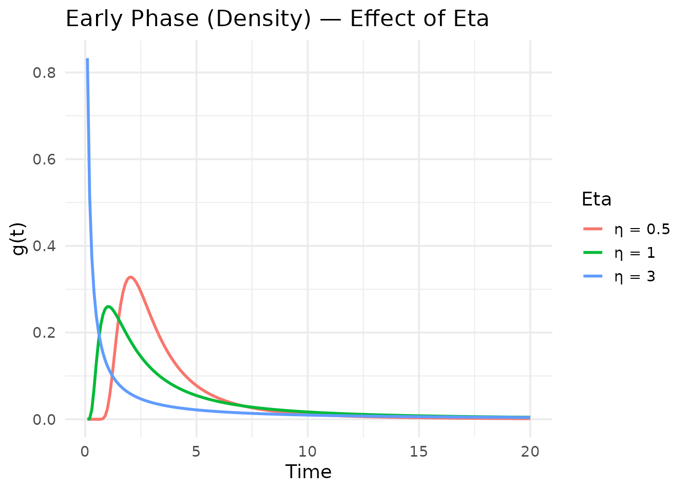
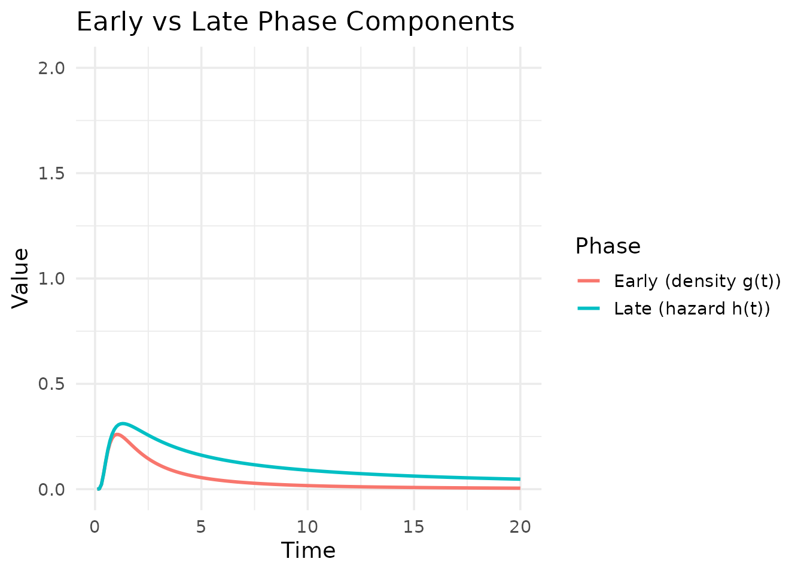

# Understanding Temporal Decomposition

``` r
library(multimix)
library(ggplot2)
```

## The temporal decomposition framework

The `multimix` model decomposes the conditional odds of a binary outcome
into two temporal components:

$$\text{Conditional odds}(t) = \exp\left( \beta_{01} + a_{1}u_{1} \right) \cdot \Lambda_{1}(t) + \exp\left( \beta_{02} + a_{2}u_{2} \right) \cdot \Lambda_{2}(t)$$

where $\Lambda_{1}(t)$ captures the **early phase** (density function
$g(t)$) and $\Lambda_{2}(t)$ captures the **late phase** (hazard
function $h(t) = g(t)/\left( 1 - G(t) \right)$).

Both functions are derived from a generalized temporal decomposition
parameterized by:

- **Half-life** ($t_{1/2}$): controls the time scale
- **Eta** ($\eta$, called `nu` internally): exponent of time
- **Gamma** ($\gamma$, called `m` internally): shape of the distribution

## Exploring temporal basis functions

Let’s visualize how the early and late phase functions behave under
different parameter settings.

### Effect of half-life

``` r
times <- seq(0.1, 20, by = 0.1)

df_thalf <- data.frame(
  Time = rep(times, 3),
  Value = c(
    get_early_phase(times, thalf = 1, eta = 1, gamma = 0),
    get_early_phase(times, thalf = 3, eta = 1, gamma = 0),
    get_early_phase(times, thalf = 8, eta = 1, gamma = 0)
  ),
  HalfLife = rep(c("t½ = 1", "t½ = 3", "t½ = 8"), each = length(times))
)

ggplot(df_thalf, aes(x = Time, y = Value, color = HalfLife)) +
  geom_line(linewidth = 1) +
  labs(
    title = "Early Phase (Density) — Effect of Half-Life",
    x = "Time", y = "g(t)", color = "Half-Life"
  ) +
  theme_minimal(base_size = 14)
```



The half-life parameter shifts the temporal scale: shorter half-lives
produce faster-decaying early phases.

### Effect of eta (time exponent)

``` r
df_eta <- data.frame(
  Time = rep(times, 3),
  Value = c(
    get_early_phase(times, thalf = 3, eta = 0.5, gamma = 0),
    get_early_phase(times, thalf = 3, eta = 1, gamma = 0),
    get_early_phase(times, thalf = 3, eta = 3, gamma = 0)
  ),
  Eta = rep(c("η = 0.5", "η = 1", "η = 3"), each = length(times))
)

ggplot(df_eta, aes(x = Time, y = Value, color = Eta)) +
  geom_line(linewidth = 1) +
  labs(
    title = "Early Phase (Density) — Effect of Eta",
    x = "Time", y = "g(t)", color = "Eta"
  ) +
  theme_minimal(base_size = 14)
```



Higher eta values produce sharper, more peaked density curves.

### Early vs late phase

``` r
df_phases <- data.frame(
  Time = rep(times, 2),
  Value = c(
    get_early_phase(times, thalf = 3, eta = 1, gamma = 0),
    get_late_phase(times, thalf = 3, eta = 1, gamma = 0)
  ),
  Phase = rep(
    c("Early (density g(t))", "Late (hazard h(t))"), each = length(times)
  )
)

ggplot(df_phases, aes(x = Time, y = Value, color = Phase)) +
  geom_line(linewidth = 1) +
  labs(
    title = "Early vs Late Phase Components",
    x = "Time", y = "Value", color = "Phase"
  ) +
  theme_minimal(base_size = 14) +
  coord_cartesian(ylim = c(0, 2))
```



The early phase (density) peaks and declines, while the late phase
(hazard) increases over time — reflecting the intuition that different
mechanisms drive the outcome at different time scales.

## Valid parameter combinations

The
[`decompos()`](https://michelleUMD.github.io/multimix/reference/decompos.md)
function handles six parameter sign combinations:

| Case | $\gamma$ (m) | $\eta$ (nu) | Behavior                  |
|------|:------------:|:-----------:|---------------------------|
| 1    |     \> 0     |    \> 0     | Standard sigmoidal        |
| 1L   |     = 0      |    \> 0     | Limiting exponential case |
| 2    |     \< 0     |    \> 0     | Heavy-tailed              |
| 2L   |     \< 0     |     = 0     | Exponential decay         |
| 3    |     \> 0     |    \< 0     | Bounded cumulative        |
| 3L   |     = 0      |    \< 0     | Bounded exponential       |

The case where **both** $\gamma < 0$ and $\eta < 0$ is mathematically
undefined and will produce an error.

## Practical guidelines

- Start with `eta = 1, gamma = 0` (exponential-like decay) for initial
  exploration
- Use the default bounds as a starting point and narrow them based on
  domain knowledge
- The half-life parameter is the most interpretable: it controls when
  each phase peaks or transitions
- If the optimizer struggles to converge, try fixing gamma parameters to
  0 via `fixed_pars`
